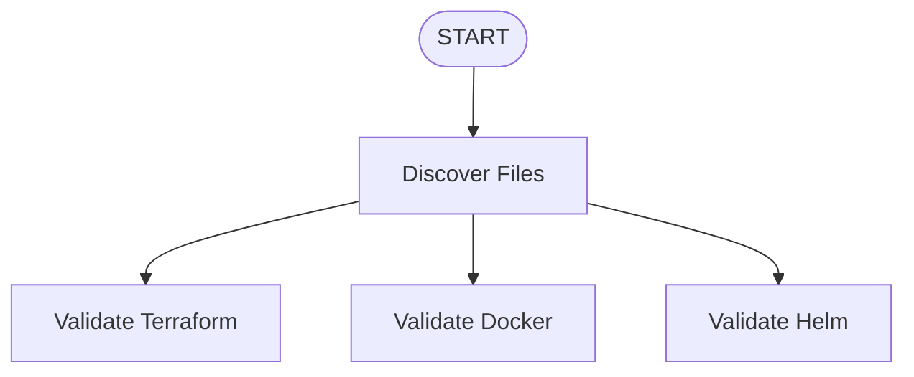

# CI/CD Agent Workflow Visualization

This directory contains visual workflow diagrams for the CI/CD Agent that validates and releases Terraform, Docker, and Helm configurations.

## Files Generated

1. **cicd_workflow.mmd** - Mermaid diagram (for GitHub, GitLab, Markdown)
2. **cicd_workflow.dot** - Graphviz DOT source file
3. **cicd_workflow.png** - PNG image (generated if graphviz binary is installed)
4. **cicd_workflow.svg** - SVG image (generated if graphviz binary is installed)

## Workflow Overview

```
START
  │
  ▼
┌─────────────────┐
│ Discover Files  │◄── Scan for .tf, Dockerfile, Chart.yaml
└────────┬────────┘
         │
    ┌────┴────┬──────────┐
    ▼         ▼          ▼
┌───────┐ ┌────────┐ ┌────────┐
│Validate│ │Validate│ │Validate│
│Terraform│ │Docker  │ │Helm    │
│• validate│ │• build │ │• lint  │
│• tflint │ │• hadolint│ │• template│
│• checkov│ │        │ │        │
└───┬───┘ └────┬───┘ └────┬───┘
    │          │          │
    └──────────┼──────────┘
               ▼
    ┌──────────────────┐
    │ Collect Errors   │◄── Aggregate all validation results
    └────────┬─────────┘
             │
             ▼
    ┌──────────────────┐
    │ Decision Point   │◄── All validations passed?
    └────────┬─────────┘
             │
    ┌────────┴────────┬──────────────────┐
    │                 │                  │
    ▼                 ▼                  ▼
┌──────────┐  ┌──────────┐       ┌──────────┐
│  YES     │  │   NO     │       │   NO     │
│          │  │(Has errs)│       │(Max att.)│
└────┬─────┘  └────┬─────┘       └────┬─────┘
     │             │                  │
     ▼             ▼                  ▼
┌──────────┐  ┌──────────┐       ┌──────────┐
│ Prepare  │  │ Fix TF   │       │   FAIL   │
│ Release  │  │ Fix Docker│      └──────────┘
└────┬─────┘  │ Fix Helm │
     │        └────┬─────┘
     │             │
┌────┴────┐        │ Loop back
│ Release │        │ (max 3 times)
│ Docker  │        ▼
│ Helm    │   ┌──────────┐
│ TF      │   │Re-validate│
└────┬────┘   └──────────┘
     │
     ▼
┌──────────┐
│ SUCCESS  │
└──────────┘
```

## Node Colors

- 🟢 **Green** - Start/End nodes
- 🔵 **Blue** - Discovery phase
- 🟡 **Yellow** - Validation phase
- 🟠 **Orange** - Decision points
- 🔴 **Red** - Fix operations
- 🟢 **Light Green** - Release operations
- 🩷 **Pink** - Error/Failure

## Key Features

1. **Parallel Validation** - All three validators (Terraform, Docker, Helm) run simultaneously
2. **Collect All Errors** - Waits for all validations to complete before making decisions
3. **Retry Loop** - Can attempt fixes up to 3 times per file type
4. **Sequential Release** - Docker → Helm → Terraform (in order)

## How to View

### Mermaid Diagram (Recommended)
The `.mmd` file can be viewed in:
- GitHub/GitLab (renders automatically in markdown)
- VS Code with Mermaid extension
- Online: https://mermaid.live

### Graphviz
To render the DOT file to images:

```bash
# Install graphviz first:
# macOS: brew install graphviz
# Ubuntu: sudo apt-get install graphviz
# Windows: choco install graphviz

# Generate PNG
dot -Tpng cicd_workflow.dot -o cicd_workflow.png

# Generate SVG
dot -Tsvg cicd_workflow.dot -o cicd_workflow.svg

# Generate PDF
dot -Tpdf cicd_workflow.dot -o cicd_workflow.pdf
```

## Regenerating

To regenerate the workflow diagrams:

```bash
python generate_workflow_graph.py
```

## Integration

You can embed the Mermaid diagram in your documentation:

```markdown
## CI/CD Agent Workflow


```

## Workflow States

The agent can be in these states:
- `running` - Initial state, discovering files
- `fixing` - Attempting to fix validation errors
- `releasing` - Executing release operations
- `success` - All operations completed successfully
- `failed` - Max fix attempts reached or release failed

## Conditional Edges

1. **Validation → Decision**: Routes based on pass/fail status
2. **Decision → Fix/Release/Fail**: 
   - All pass → Release
   - Has errors + attempts < 3 → Fix
   - Has errors + attempts >= 3 → Fail
3. **Fix → Validation**: Loops back for re-validation (dashed line)
